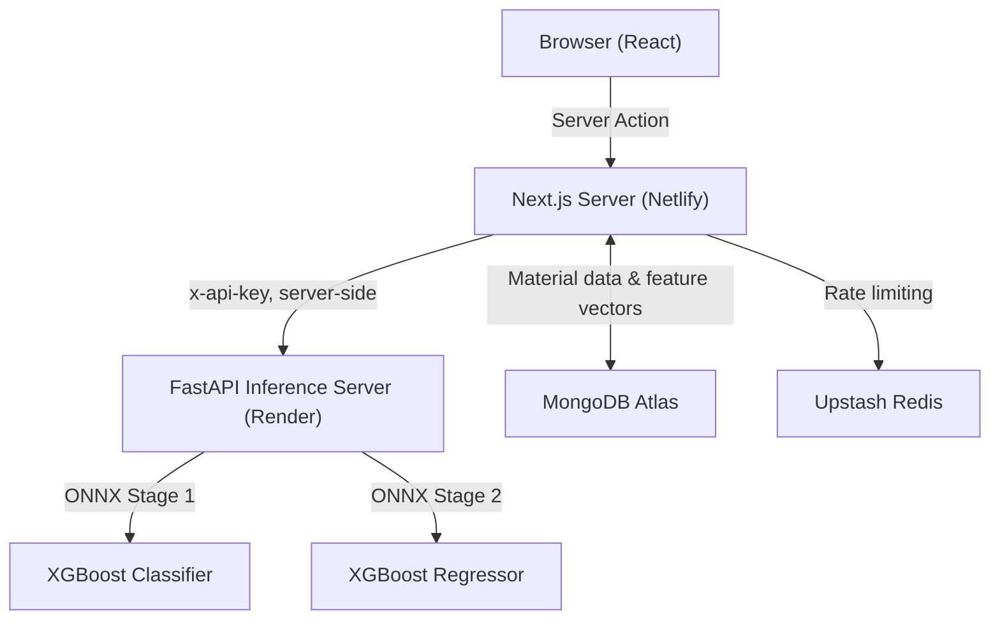

# CrystaLogiX

> **GPU-accelerated bandgap prediction for crystalline materials** — a full-stack research interface built on a two-stage hurdle framework with conformal uncertainty quantification.

[](https://nextjs.org/)
[](https://onnx.ai/)
[](https://mongodb.com/)
[](https://fastapi.tiangolo.com/)

---

## Overview

CrystaLogiX addresses the **zero-inflation problem** in bandgap prediction: ~52% of crystalline materials in the Materials Project are metallic (E<sub>g</sub> = 0 eV), which severely distorts naive regression models. The solution is a **two-stage hurdle framework**:

| Stage           | Task                               | Method                                     |
| --------------- | ---------------------------------- | ------------------------------------------ |
| **Stage 1**     | Metal vs. non-metal classification | XGBoost (threshold-tuned, ROC-AUC: 0.9843) |
| **Stage 2**     | Bandgap regression for non-metals  | 5-model XGBoost ensemble + bias correction |
| **Uncertainty** | Calibrated prediction intervals    | Split-conformal prediction (PI₉₀ / PI₉₅)   |

**End-to-end performance on ~40k held-out materials:**

- Global MAE: **0.2336 eV** &nbsp;|&nbsp; Global R²: **0.8945**

---

## System Architecture

CrystaLogiX separates concerns between a Next.js front-end (Netlify) and a Python inference server (Render).



### Deployment Topology

| Service          | Platform      | Purpose                              |
| ---------------- | ------------- | ------------------------------------ |
| Next.js App      | Netlify       | UI, Server Actions, API proxy routes |
| Inference Server | Render        | FastAPI + ONNX model serving         |
| Database         | MongoDB Atlas | Material data + prediction logs      |
| Rate Limiter     | Upstash Redis | Sliding window 10 req/min per IP     |

---

## Features

### Interactive Simulator (`/simulator`)

- Search and browse ~200k Materials Project entries (debounced, MongoDB-backed)
- Route any material through the full two-stage pipeline in real time
- Outputs per prediction:
  - Metal / non-metal classification with probability scores
  - Predicted bandgap (eV) vs. actual DFT value and absolute error
  - Energy level diagram (valence band, conduction band, gap or overlap)
  - Execution path (Stage 1 only vs. both stages) and wall-clock time
- Live model runtime status indicator (connecting / ready / down)

### Framework Explorer (`/framework`)

- End-to-end pipeline walkthrough: data curation → featurization → classification → regression → conformal calibration
- Dataset statistics: metallic share, non-metal subset size, train/calibration/test splits
- Feature engineering path: 145 Magpie compositional descriptors → 87 features after variance and collinearity filtering

### Results Dashboard (`/results`)

- Full-pipeline and stage-wise metrics (MAE, R², coverage)
- Conformal interval statistics (mean PI widths, empirical coverage at 90% / 95%)
- Benchmark table vs. DFT-PBE, CGCNN, MEGNet, GATGNN
- Error anatomy and known limitations

### UI

- Dark / light / system themes via `next-themes`
- Fully responsive (desktop + mobile navigation)
- Animated hero and materials-science–themed visualizations

---

## Tech Stack

| Layer         | Technologies                                                        |
| ------------- | ------------------------------------------------------------------- |
| Front-end     | Next.js 14 (App Router), React, TypeScript, Tailwind CSS, shadcn/ui |
| Back-end      | Next.js API routes, Server Actions, MongoDB (`mongodb` driver)      |
| Inference     | Python, FastAPI, ONNX Runtime (XGBoost models)                      |
| Rate Limiting | Upstash Redis + `@upstash/ratelimit` (sliding window)               |
| Data Prep     | RAPIDS cuDF (GPU-accelerated, research pipeline)                    |
| Hosting       | Netlify (Next.js) + Render (FastAPI)                                |

---

## Project Structure

```
CrystaLogix/
├── app/
│   ├── page.tsx                    # Landing / overview
│   ├── layout.tsx                  # Root layout & ThemeProvider
│   ├── globals.css                 # Global Tailwind / CSS styles
│   ├── favicon.ico                 # App favicon
│   ├── simulator/page.tsx          # Interactive predictor page
│   ├── framework/page.tsx          # Pipeline & modeling details page
│   ├── results/page.tsx            # Metrics, benchmarks, parity plots page
│   ├── actions/                    # Server Actions
│   │   └── predict.ts              # Server Action — browser calls this, never fetches directly
│   ├── api/                        # API Route Handlers for external callers (curl, scripts)
│   │   ├── predict/route.ts        # Proxy route for ML prediction
│   │   ├── materials/route.ts      # Material search (public)
│   │   ├── get-label/route.ts      # Feature vector fetch (rate limited)
│   │   ├── features/route.ts       # Feature metadata (public)
│   │   └── health/route.ts         # Inference server health check (public)
│   ├── components/                 # Page-specific or feature-specific UI components
│   │   ├── BandgapPredictor.tsx    # Bandgap prediction interface
│   │   ├── BenchmarkLiftBars.tsx   # Visualization for model benchmarks
│   │   ├── ScreeningSimulator.tsx  # Core screening simulation logic
│   │   ├── SiteNav.tsx             # Main desktop/mobile navigation container
│   │   ├── desktop-nav.tsx         # Desktop navigation layout
│   │   ├── mobile-nav.tsx          # Mobile responsive drawer navigation
│   │   ├── Logo.tsx                # Branding logo asset/component
│   │   ├── MotionAnimation.tsx     # Framer Motion wrapper utilities
│   │   ├── Section.tsx             # Layout block wrapper component
│   │   ├── SiteFooter.tsx          # Application footer layout
│   │   ├── theme-provider.tsx      # Next-themes provider wrapper
│   │   └── sim/                    # Nested sub-components for the simulator
│   │       ├── EnergyLevelDiagram.tsx # Bandgap/energy level SVG visualizer
│   │       ├── GlowDot.tsx         # Animated UI accent status dot
│   │       ├── LabelInfo.tsx       # Metadata descriptor tooltips
│   │       ├── ProbBar.tsx         # Probability distribution visualizer
│   │       ├── ResultCard.tsx      # Prediction outputs display wrapper
│   │       └── StatusFallback.tsx  # Dynamic loading and state skeletons
│   └── data/
│       └── research.ts             # Hardcoded scientific/research outcomes
├── components/                     # Reusable global/shared UI components
│   ├── ToggleMode.tsx              # Dark/light mode theme toggle button
│   └── ui/                         # Shadcn UI low-level primitives
│       ├── button.tsx              # Button element component
│       ├── dropdown-menu.tsx       # Dropdown overlay component
│       └── sheet.tsx               # Slide-out drawer/sheet component
├── lib/
│   ├── mongodb.ts                  # MongoDB connection helper
│   ├── onnxInference.ts            # direct ONNX inference configuration
│   ├── types.ts                    # Shared TypeScript interfaces & types
│   ├── utils.ts                    # Tailwind CSS merge utilities (cn)
│   └── feature_names.json          # Key-value map of feature property names
├── public/                         # Static assets served directly to the browser
│   ├── Parity Plots - Full Pipeline.png # Model accuracy diagnostic chart
│   ├── Pipeline.png                # Architecture pipeline schematic graphic
│   └── favicon/manifest items...   # Web icons, manifests, and favicons
├── middleware.ts                   # Upstash rate limiting or auth configuration
├── .env.local                      # Environment configuration secrets (git-ignored)
├── next.config.ts                  # Next.js framework configuration options
├── tsconfig.json                   # TypeScript configuration profile
├── package.json                    # Node.js project manifests and script shortcuts
└── readme/lint artifacts...        # README.md, .gitignore, and lint setups
```

---

## API Reference

### `GET /api/materials?q=<query>&limit=<n>`

Search materials by ID or formula. Returns paginated metadata. Public, no auth required.

### `POST /api/get-label`

Returns the ordered 87-element feature vector for a material. Rate limited (10 req/min per IP).

**Response:**

```json
{
  "success": true,
  "id": "mp-21727",
  "feature_count": 87,
  "features": [4, 3.85, 6.431, 15, "..."]
}
```

### `POST /api/predict`

Runs the two-stage prediction pipeline. Rate limited (10 req/min per IP).

**Request:**

```json
{ "features": [0.12, 3.45, "..."] }
```

**Response:**

```json
{
  "stage1": {
    "is_metal": false,
    "class_label": 1,
    "prob_metal": 0.003196,
    "prob_non_metal": 0.996804
  },
  "stage2": {
    "bandgap_ev": 1.4823,
    "bandgap_category": "semiconductor"
  }
}
```

### `GET /api/features`

Returns feature names, ordering, and total count. Public.

### `GET /api/health`

Probes the inference server. Used by the simulator's runtime status indicator. Public.

### Error Codes

| Status | Meaning                | Cause                                                      |
| ------ | ---------------------- | ---------------------------------------------------------- |
| `400`  | Bad Request            | Wrong feature count, malformed JSON, or non-numeric values |
| `401`  | Unauthorized           | Missing or invalid `x-api-key` on FastAPI                  |
| `413`  | Payload Too Large      | Request body exceeds 64 KB                                 |
| `415`  | Unsupported Media Type | `Content-Type` is not `application/json`                   |
| `429`  | Too Many Requests      | Rate limit exceeded — see `Retry-After` header             |
| `500`  | Inference Error        | ONNX runtime threw during prediction                       |
| `502`  | Bad Gateway            | Next.js could not reach the FastAPI server                 |
| `503`  | Service Unavailable    | Missing env vars on Next.js server (fails closed)          |

---

## Model Details

### Dataset

- ~200k crystalline entries from the Materials Project + custom curated data
- ~52.2% metallic (E<sub>g</sub> = 0 eV); non-metal subset: ~95,920 entries
- Split: 72% train / 8% calibration / 20% test; held-out test set: ~40,098 materials

### Featurization

- 145 Magpie-style compositional descriptors → variance + collinearity filtering → **87 features**
- Target encoding and feature scaling fitted exclusively on training data

### Stage 1 — Classifier

- XGBoost binary classifier
- Decision threshold lowered to ~0.28 to maximize non-metal recall (ROC-AUC: 0.9843)
- ONNX input node: `float_input`, shape `[1, 87]`

### Stage 2 — Regressor

- 5-model XGBoost ensemble trained on `log(1 + Eg)`
- Bin-wise bias correction layer to reduce high-energy tail bias
- ONNX input node: `float_input`, shape `[1, 87]`

### Uncertainty — Conformal Prediction

- Split-conformal intervals at 90% and 95% coverage levels
- Calibrated on the held-out calibration set (never seen during training)

---

## Security Model

| Threat                                 | Protected? | Mechanism                                            |
| -------------------------------------- | ---------- | ---------------------------------------------------- |
| API key exposed in browser             | ✅ Yes     | Server Action — secret never sent to client          |
| Other websites calling API via browser | ✅ Yes     | CORS locked to `crystalogix.netlify.app`             |
| Script / curl abuse                    | ⚠️ Partial | Rate limited to 10 req/min per IP via Upstash        |
| Missing env vars on deploy             | ✅ Yes     | Fails closed — returns `503` if key or URL not set   |
| FastAPI header probing (missing key)   | ✅ Yes     | Returns `401` not `422` — doesn't leak header schema |
| Coordinated multi-IP attack            | ❌ No      | Requires Cloudflare WAF or Netlify WAF               |

The `API_SECRET_KEY` is injected server-side in the Server Action — it is never present in any client-side JavaScript bundle or network request visible in DevTools.

---

## Environment Variables

### Netlify (Next.js)

| Variable                   | Required | Description                                              |
| -------------------------- | -------- | -------------------------------------------------------- |
| `INFERENCE_SERVER_URL`     | Yes      | Full URL of Render FastAPI server — no trailing slash    |
| `API_SECRET_KEY`           | Yes      | Shared secret sent as `x-api-key` to FastAPI             |
| `NEXT_PUBLIC_APP_URL`      | Yes      | Your Netlify URL, e.g. `https://crystalogix.netlify.app` |
| `UPSTASH_REDIS_REST_URL`   | Yes      | Upstash Redis endpoint                                   |
| `UPSTASH_REDIS_REST_TOKEN` | Yes      | Upstash Redis auth token                                 |
| `MONGODB_URI`              | Yes      | MongoDB Atlas connection string                          |

> **Important:** Netlify does not hot-reload environment variables. After adding or changing any variable, trigger a fresh deploy.

---

## Limitations

CrystaLogiX is a **screening and insight tool**, not a replacement for high-fidelity calculations:

- Extrapolation degrades for wide-gap insulators (E<sub>g</sub> > 5 eV)
- Magpie descriptors do not capture defects, surfaces, or f-block behavior
- Ground-truth labels carry PBE-level DFT noise
- Conformal coverage guarantees are marginal, not conditional on every compositional family

---

## Contact

CrystaLogiX was built as part of a materials informatics research effort by **Devansh Tyagi**.

- **GitHub:** [devanshtyagi26](https://github.com/devanshtyagi26)
- **LinkedIn:** [tyagi-devansh](https://linkedin.com/in/tyagi-devansh)
- **Email:** [tyagidevansh3@gmail.com](mailto:tyagidevansh3@gmail.com)
- **Portfolio:** [https://devanshportfolio-hazel.vercel.app/](https://devanshportfolio-hazel.vercel.app/)
